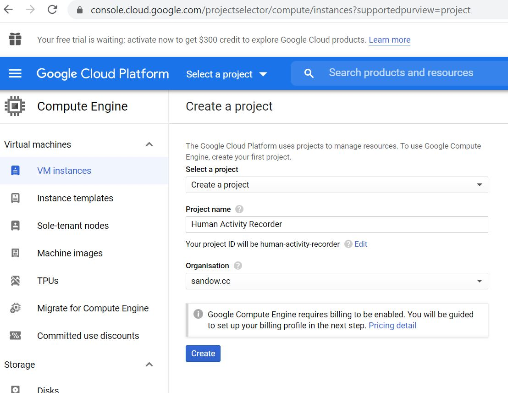
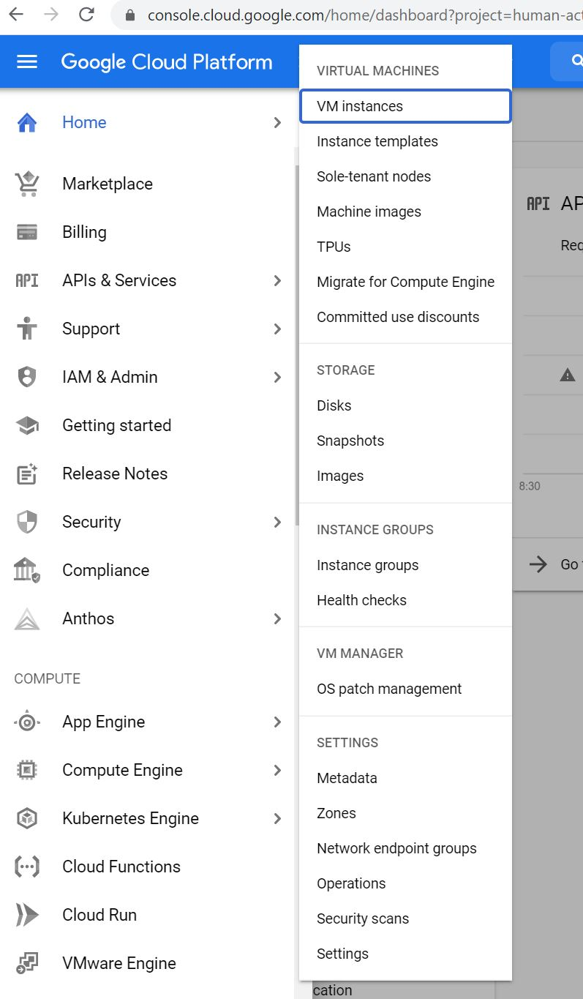
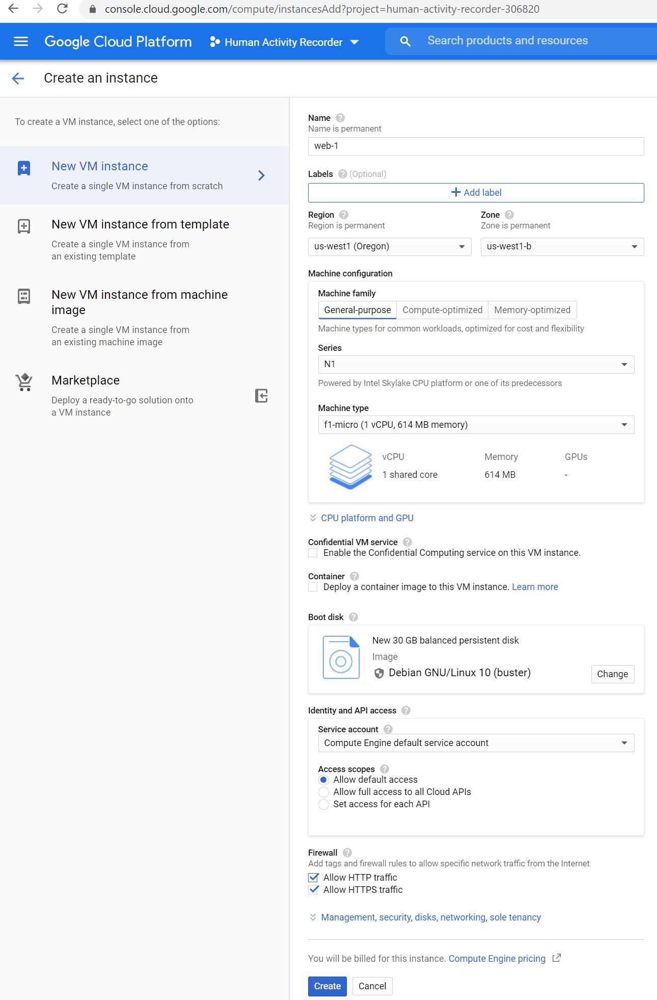
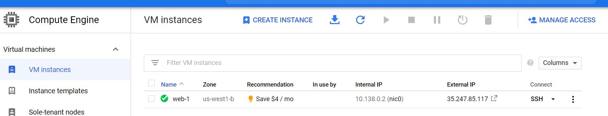

# Server Setup
## General
For the app to store the collected values you need to setup a server system, that accepts json data. 

We chose to use a linux machine on gcp (Google Compute Platform). Google is so kind as to provide a lifetime free version of its gcp instances, that is sufficient to be used with this setup, see [https://cloud.google.com/free]. The following setup instructions have been tested in Feb 2021 on the gcp free tier. For the app to work properly with your server, you will need a name (DNS) and a certificate for that name. The following explanations assume you use [https://godaddy.com] as your registrar for your chosen domain name and [https://letsencrypt.org] as your certificate provider.

Of course the functionality required of the server system is minimal, so it can be setup using all kinds of different solutions, including but not limited to a windows PC, or even a smartphone, as long as you can run a webserver with php on that infrastructure. The following is just one possible solution.

## Setup
### Create a project
[https://console.cloud.google.com/projectselector/compute/instances?supportedpurview=project]



### Create your VM / Compute Instance
Inside your project go to "Compute Engine" -> "VM instances"



We use a f1-micro instance in zone us-west1-b and an debian-10-buster-v20210122 image, with 30 GB disk (maximum amount in the free tier) and let http as well as https traffic through the firewall. It needs to be both as letsencrypt needs those to verify your ownership of the VM and its name.


In the "VM instances" view you can open an ssh connection to your newly created VM.


With the following commands, that you can paste into your ssh session, your VM is setup for use as a backend of the "Human Activity Recorder" app. Please replace the server name with your own fully qualified domain name on line 2 of the following script. You will have to reply to the certbot questions at the end.
```
sudo su -
export FQDN=unibe.sandow.cc
umask 022
mkdir /var/www/$FQDN /var/www/uploads
echo '<h1>My Web Page</h1>' > /var/www/$FQDN/index.html
# TODO vi /etc/apache2/sites-available/unibe.sandow.cc.conf
apt install python3-certbot-apache php
chown www-data /var/www/uploads
service apache2 restart
curl -o /var/www/$FQDN/my-university.php https://raw.githubusercontent.com/sandowm/aml-motion-android/master/server/my-university.php
certbot --apache -d $FQDN
```

If everything worked (it never does the first time ;-) ) you should be able to access your new webserver with your favorite web browser.